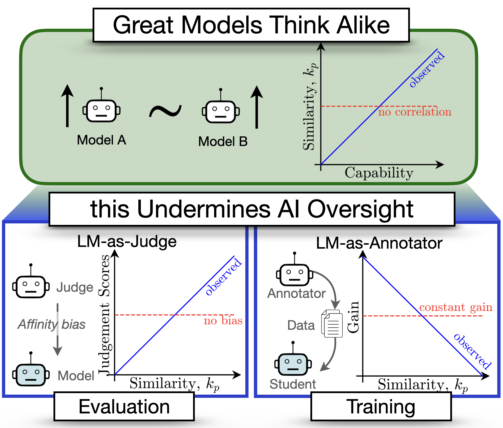

# Applications
<!-- <h2 align="center">
Great Models Think Alike this Undermines AI Oversight <br>
<span style="font-size: x-small; font-weight: normal;">Goel, Strüber, Auzina, Chandra, Kumaraguru, Kiela, Prabhu, Bethge, and Geiping (2025).</span>
</h2>

<p align="center">
  <a href="https://arxiv.org/abs/XXXX.XXXXX" target="_blank">
    
  </a>
  &nbsp;&nbsp;&nbsp;&nbsp;
  <a href="https://model-similarity.github.io/" target="_blank">
    
  </a>
</p> -->
**Great Models Think Alike and this Undermines AI Oversight**  
[Shashwat Goel](https://shash42.github.io/), [Joschka Strüber](https://github.com/the-klingspor), [Ilze Amanda Auzina](https://ilzeamandaa.github.io), [Karuna K Chandra](https://www.linkedin.com/in/karuna-k-c-519945214), [Ponnurangam Kumaraguru](https://precog.iiit.ac.in/), [Douwe Kiela](https://douwekiela.github.io), [Ameya Prabhu](https://drimpossible.github.io), [Matthias Bethge](https://bethgelab.org), [Jonas Geiping](https://jonasgeiping.github.io)

[[Paper](https://arxiv.org/abs/2502.04313)] [[Webpage](https://model-similarity.github.io)] [[Interactive Tool](https://huggingface.co/spaces/bethgelab/lm-similarity)] [[Data](https://huggingface.co/datasets/bethgelab/lm-similarity)]

<p align="center">
<a href="url"></a>
</p>


<!-- We use $\kappa_p$ to showcase the importance of reporting and correcting for model similarity, especially in the emerging paradigm of AI oversight. As summarised in Fig.1 we explore the following applications: -->

<!-- <p align="center">
  
  <br/>
     <em>Figure 1: Our Main Contributions</em>
  <br/><br/>
</p>

<div style="flex: 1;">
        "Great Models Think Alike":
        <ul>
            <li>Model Capabilities</li>
        </ul>
       "this Undermines AI Oversight":
        <ul>
            <li>LM-as-a-Judge</li>
            <li>LM-as-a-Annotator</li>
        </ul>
</div> -->


<!-- ## Results
We find the following observations with respect to the applications listed above:
- **Model Capabilities**: model errors are getting more correlated as capabilities increase
- **LM-as-a-Judge**: LLM-as-a-judge scores are biased towards more similar
models controlling for the model’s capability
- **LM-as-a-Annotator**: gain from training strong models on annotations of weak supervisors
(weak-to-strong generalization) is higher when the two models are more different  -->


## Structure 
Code files and instructions on reproducing experiments and downloading data for each application are provided in separate folders as follows:

- **Model Capabilities**: $\rightarrow$ Capabilities 
- **LM-as-a-Judge** $\rightarrow$ Judges
- **LM-as-a-Annotator** $\rightarrow$ Annotators

## Set Up the Environment

Create a new environment:

```
conda create -n env_sim python=3.11 -y
conda activate env_sim
```

Install torch:

```
conda install pytorch torchvision torchaudio pytorch-cuda=12.1 -c pytorch -c nvidia
```

Install a CUDA version that exactly matches the pytorch-cuda version. In our environment, this was necessary to install flash attention.

```
conda install nvidia/label/cuda-12.1.0::cuda-toolkit -c nvidia/label/cuda-12.1.0
```

Install the remaining requirements using pip.

```
pip install -r requirements.txt
```

## Citation
To cite our work:

```
@misc{goel2025greatmodelsthinkalike,
      title={Great Models Think Alike and this Undermines AI Oversight}, 
      author={Shashwat Goel and Joschka Struber and Ilze Amanda Auzina and Karuna K Chandra and Ponnurangam Kumaraguru and Douwe Kiela and Ameya Prabhu and Matthias Bethge and Jonas Geiping},
      year={2025},
      eprint={2502.04313},
      archivePrefix={arXiv},
      primaryClass={cs.LG},
      url={https://arxiv.org/abs/2502.04313}, 
}
```

